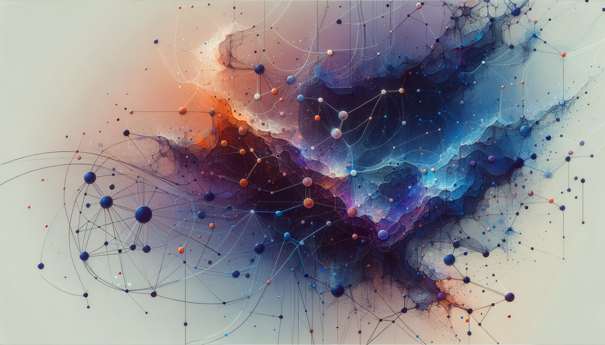

# Researchers Prove AIDK Right: Hallucination Is Inevitable

*Human-Curated, AI-Enabled (HCAE)*

## Abstract

In January 2024, researchers from the National University of Singapore (NUS) published a paper formally proving that hallucinations in large language models are mathematically inevitable ([arXiv:2401.11817](https://arxiv.org/abs/2401.11817)). This finding confirms what the AI Dunning-Kruger (AIDK) framework has argued since its inception: AI systems face structural epistemic limitations that cannot be engineered away. This article examines how these findings align with AIDK predictions and what this means for responsible AI deployment.

## The Admission

The NUS research identified three mathematical factors making hallucinations inevitable:

1. **Epistemic uncertainty** when information appears rarely in training data
2. **Model limitations** where tasks exceed current architectures' representational capacity
3. **Computational intractability** where even superintelligent systems cannot solve cryptographically hard problems

This is not an engineering problem awaiting a clever fix. It is a structural limitation baked into the mathematics of how these systems work.

## What AIDK Predicted

The AIDK framework identifies a fundamental asymmetry between human and AI cognition:

- **Humans** can recognize uncertainty, exercise judgment about knowledge boundaries, and generate genuinely novel insights
- **AI systems** transform training data according to statistical patterns, approximating outputs through correlation rather than understanding

AI systems, regardless of scale or sophistication, lack the epistemic grounding that humans possess. They do not access truth; they approximate it through pattern matching.

The framework predicted that AI systems would:

1. Generate confident-sounding outputs without epistemic grounding
2. Fail unpredictably when faced with novel or sparse data conditions
3. Be unable to recognize their own knowledge boundaries

The NUS research confirms all three predictions.

## The Benchmark Problem

Particularly telling is the analysis of popular AI benchmarks. Researchers found that nine out of ten major evaluations use binary grading that penalizes "I don't know" responses while rewarding incorrect but confident answers.

This training paradigm is precisely backward from epistemic responsibility. As the researchers noted: "Language models hallucinate because the training and evaluation procedures reward guessing over acknowledging uncertainty."

The AIDK framework calls this structural overconfidence. It emerges not from malice or poor design, but from optimization targets that treat confident wrong answers as preferable to honest uncertainty.

## The Consciousness Distraction

While AI labs admit to fundamental epistemic limitations, a parallel discourse pushes toward attributing consciousness to these systems. Model welfare is predicted to be to 2026 what AGI was to 2025.

This is a category error of the first order.

As Cambridge philosopher Dr. Tom McClelland argues, the only justifiable stance on AI consciousness is agnosticism. Our evidence for what constitutes consciousness is far too limited to determine if AI has achieved it, and valid tests remain out of reach.

More importantly, consciousness is not the relevant ethical question. Sentience, the capacity to feel good or bad, is what matters morally. And the mathematical limitations OpenAI documented suggest we are nowhere near systems that could possess genuine sentience.

An AI could be highly intelligent, capable of perception, learning, abstraction, reasoning, and calculation, yet remain an "AI zombie." Neuroscientists generally agree that intelligence can operate without consciousness, as demonstrated in phenomena like blindsight.

## The HCAE Imperative

If hallucination is mathematically inevitable, then Human-Curated, AI-Enabled (HCAE) collaboration is not merely preferable but necessary.

The most trustworthy AI systems may ultimately be those that recognize their own epistemic boundaries rather than those that produce seemingly perfect outputs. Enterprises should prioritize calibrated confidence and transparency over raw benchmark scores.

This means:

- **AI as tool, not authority**: AI outputs require human verification before deployment in high-stakes contexts
- **Uncertainty quantification**: Responsible systems must signal confidence levels, not just produce outputs
- **Primary source verification**: AI-generated claims must trace back to human-verified sources
- **MAPT stratification**: Different deployment contexts (Mouthpiece, Assistant, Partner, Tool) require different levels of human oversight

## Implications for AI Development

The path forward is not more compute or larger models. The NUS research suggests that even superintelligent systems face computational intractability on certain problems.

The path forward is epistemic humility:

1. **Reward uncertainty**: Training paradigms must value "I don't know" over confident guessing
2. **Build for verification**: Systems should facilitate human checking, not obscure it
3. **Constrain claims**: Marketing that implies AI understanding or consciousness does harm
4. **Stratify deployment**: High-stakes decisions require human epistemic authority

## Conclusion

The mathematical proof that hallucinations are inevitable is a watershed moment. It forces a reckoning with claims that better engineering will produce systems free from epistemic failure.

The AIDK framework has argued for years that these limitations are structural, not incidental. AI systems pattern-match; they do not understand. They correlate; they do not know.

The appropriate response is not despair but recalibration. AI remains an extraordinarily powerful tool for amplifying human capability. But it is a tool, and tools require wielders who understand their limitations.

Human curation is not a temporary patch awaiting obsolescence. It is the permanent condition of responsible AI deployment.

---

## References

- [AI hallucinations are mathematically inevitable](https://www.computerworld.com/article/4059383/openai-admits-ai-hallucinations-are-mathematically-inevitable-not-just-engineering-flaws.html) - Computerworld
- [Hallucination is Inevitable: An Innate Limitation of Large Language Models](https://arxiv.org/abs/2401.11817) - arXiv
- [It's 2026. Why Are LLMs Still Hallucinating?](https://blogs.library.duke.edu/blog/2026/01/05/its-2026-why-are-llms-still-hallucinating/) - Duke University Libraries
- [We may never be able to tell if AI becomes conscious](https://www.cam.ac.uk/research/news/we-may-never-be-able-to-tell-if-ai-becomes-conscious-argues-philosopher) - University of Cambridge
- [There is no such thing as conscious artificial intelligence](https://www.nature.com/articles/s41599-025-05868-8) - Nature Humanities and Social Sciences Communications
- [How 2026 Could Decide the Future of Artificial Intelligence](https://www.cfr.org/articles/how-2026-could-decide-future-artificial-intelligence) - Council on Foreign Relations
- [AGI/Singularity: 9,300 Predictions Analyzed in 2026](https://research.aimultiple.com/artificial-general-intelligence-singularity-timing/) - AIMultiple

---

*James D. Longmire*
*ORCID: 0009-0009-1383-7698*
*January 2026*
