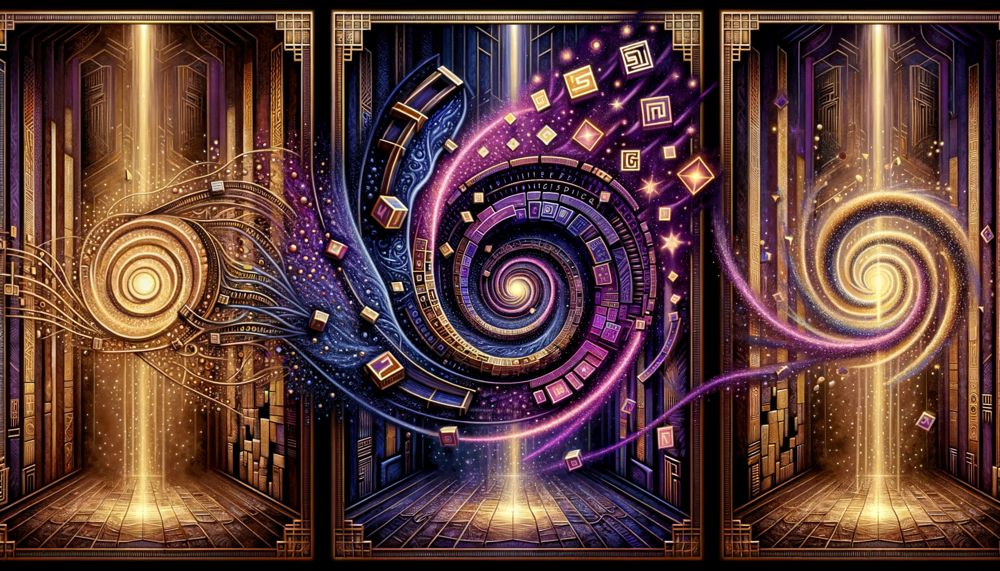

# The Three Acts of a Language Model
*Embedding, Transforming, and Unembedding—A Story in Two Registers*

---

## 1. Story Time

When you type a sentence into ChatGPT, something has to happen between your words going in and the AI's words coming out. That something has three acts: the words go *into* a strange space, they *move around* inside it, and then they come *back out* as new words.

Think of it like a play with three acts. In Act One, the actors walk onto the stage. In Act Two, they interact with each other—talking, reacting, changing positions. In Act Three, they take their bows and leave. The AI does something similar, except the stage is made of numbers and the actors are your words.

---

### Act One: Embedding (Going In)

Your words can't stay as letters. The computer needs numbers to work with. So the first thing that happens is translation: each word-piece gets converted into a long list of numbers.

Imagine a massive warehouse with thousands of shelves, and on each shelf sits a unique object. The word "cat" has its own shelf. The word "democracy" has its own shelf. The word "or" has its own shelf. When you type a word, the computer walks to that shelf, picks up the object, and carries it to the stage.

But here's the key: the object isn't just a label. It's a *position* in a vast space. Think of a city map, except instead of two dimensions (north-south and east-west), this map has hundreds or even thousands of dimensions. Each word-piece sits at a specific address in this high-dimensional city.

Words that get used in similar ways end up living in similar neighborhoods. "Cat" and "dog" are neighbors. "Run" and "sprint" live on the same block. "The" lives in a busy downtown district with other common words. "Defenestration" lives in a quiet suburb with other rare words.

When you type "The cat sat on the mat," six objects get pulled from the warehouse and placed on the stage: one for "The," one for "cat," one for "sat," one for "on," one for "the," and one for "mat." Each object carries its address—its position in the high-dimensional city. That's [embedding](https://en.wikipedia.org/wiki/Word_embedding): converting symbols into positions.

But there's a problem. Right now, each word only knows *its own* address. "Cat" doesn't know it's sitting next to "sat." The objects are on stage, but they haven't looked at each other yet.

---

### Act Two: Transforming (Moving Around)

This is where the magic happens. The objects on stage start paying attention to each other.

Remember the flashlight metaphor from the previous piece? Each word shines a spotlight on the other words, asking: "Who here matters to me?" The word "sat" shines light on "cat" because it wants to know *who* sat. It shines light on "on" because it wants to know *where*. It shines less light on "the" because "the" doesn't tell it much.

After this round of looking around, each object *updates its position*. Not on the physical stage—they stay in the same order. But their addresses shift. "Cat" started at its generic warehouse address, the same address it would have in any sentence. But after looking at "sat," "on," and "mat," the address for "cat" moves slightly. It's no longer just generic-cat. It's *cat-that-sat-on-something*.

This happens again and again. In a typical language model, there are dozens of these "look around and update" rounds, stacked on top of each other. Each round is called a *layer*.

In the early layers, words mostly notice their immediate neighbors. "Cat" notices "the" and "sat." In later layers, words notice patterns that span the whole sentence. By the final layer, "cat" has been updated so many times that its address encodes not just "cat" but "the specific cat in this specific sentence doing this specific thing."

Think of it like a cocktail party. At first, people talk to whoever's standing nearby. Then conversations merge, gossip spreads, and by the end of the night, everyone knows what everyone else said. Except here, "knowing" means adjusting your position in the high-dimensional city based on what you learned.

After all the layers, the objects on stage have moved—not in sequence, but in meaning-space. Each one now sits at an address that reflects its role in *this particular sentence*, not just its generic dictionary meaning.

---

### Act Three: Unembedding (Coming Out)

Now the model needs to produce output. It's done listening to your sentence. Time to respond.

The model looks at the final position of the *last* word-piece on stage. (In our example, that's "mat.") This position has been updated through all those layers. It encodes everything the model "understood" about the sentence.

But a position isn't a word. To produce output, the model has to translate back—from number-address to word-piece. This is unembedding: the reverse of what happened in Act One.

Here's how it works. The model takes that final position and asks: "Which shelf in the warehouse is closest to here?" Except it doesn't just pick the closest one. It measures the distance to *every* shelf—every possible word-piece—and converts those distances into probabilities.

Shelves that are close get high probability. Shelves that are far get low probability. If the model has processed the sentence well, the shelf for a sensible next word (maybe "." or "is" or "soft") will be nearby, and random words like "defenestration" will be far away.

The model then picks a word-piece based on these probabilities. Usually it picks something likely, but there's some randomness involved—that's why the AI doesn't give the exact same answer every time.

Once it picks a word-piece, that word-piece goes back into Act One: it gets embedded, joins the other words on stage, goes through all the transforming layers, and produces a new position for unembedding. The cycle repeats, word by word, until the model decides it's done (usually by producing a special "stop" token).

---

### The Whole Picture

So the three acts form a loop:

1. **Embed**: Convert word-pieces into positions in a high-dimensional space.
2. **Transform**: Let those positions attend to each other and update, layer after layer, until each position reflects its context.
3. **Unembed**: Convert the final position back into probabilities over word-pieces, pick one, and repeat.

Your words go in as symbols, become geometry, interact as geometry, and come back out as symbols. The AI never "sees" words the way you do. It only ever works with positions and distances and directions in a space you can't visualize but that encodes, somehow, the patterns of human language.

---

## 2. Technical Time

Now the same three acts, with the actual math and architecture.

---

### Act One: Embedding

**Token embedding.** After [tokenization](https://en.wikipedia.org/wiki/Lexical_analysis#Tokenization) (see [BPE](https://en.wikipedia.org/wiki/Byte_pair_encoding) in the previous piece), you have a sequence of token IDs—just integers. If your vocabulary has 50,000 tokens, each ID is a number between 0 and 49,999. The sentence "The cat sat" might become the IDs [464, 3797, 3332].

But integers aren't useful for computation. The number 3797 isn't "closer" to 3798 than to 12 in any meaningful sense—they're just labels. The model needs vectors: lists of numbers that can be added, multiplied, and compared geometrically.

So the model maintains a massive lookup table called the *embedding matrix*, written *W_E*. Picture a spreadsheet with 50,000 rows (one per token in the vocabulary) and, say, 768 columns (the "embedding dimension"—how many numbers describe each token). Row 0 contains 768 numbers for token 0. Row 3797 contains 768 numbers for token 3797.

When the model sees token ID 3797, it simply retrieves row 3797 from this table. That row—a list of 768 numbers—is the token's *[embedding vector](https://en.wikipedia.org/wiki/Word_embedding)*. Mathematically, we write this vector as *e_t* ∈ ℝ^d, which just means "a list of *d* real numbers associated with token *t*."

At initialization, these 768 numbers are random. The embedding for "cat" is meaningless noise. But during training, every time "cat" appears, the model adjusts those 768 numbers slightly—whichever direction reduces prediction error. Over billions of updates, the embedding for "cat" drifts toward a configuration that makes "cat" useful in context: near "dog" and "pet," far from "democracy" and "nonetheless."

The embedding matrix is *learned*, not designed. Nobody decided that dimension 417 should encode "animacy" or that dimension 82 should encode "verb-ness." The training process finds whatever configuration minimizes loss, and the resulting dimensions are uninterpretable mixes of features that happen to work.

**Positional encoding.** [Transformers](https://en.wikipedia.org/wiki/Transformer_(deep_learning_architecture)) process all tokens in parallel—unlike older models that read words one at a time, left to right. This is faster, but it creates a problem: the model has no idea what order the words are in. "The cat sat on the mat" and "mat the on sat cat the" would look identical, because the model sees all six tokens at once with no sequence information.

To fix this, we add a *[positional encoding](https://en.wikipedia.org/wiki/Transformer_(deep_learning_architecture)#Position_encoding)* to each token's embedding—a second vector that says "I'm in position 1" or "I'm in position 47." The model adds this position vector to the token vector, so the combined result encodes both *what* the token is and *where* it sits in the sequence.

The original transformer paper used a clever trick: instead of learning these position vectors, they generated them using sine and cosine waves of different frequencies. Position 1 gets one pattern of waves, position 2 gets a slightly shifted pattern, position 100 gets a very different pattern. These wave patterns are *fixed*—calculated once using a formula, never updated during training. The math guarantees that nearby positions have similar encodings and distant positions have different encodings, which helps the model learn position-sensitive patterns.

Most modern models skip this and just *learn* the position vectors the same way they learn token embeddings: start random, adjust during training. Others use fancier schemes ([RoPE](https://arxiv.org/abs/2104.09864), [ALiBi](https://arxiv.org/abs/2108.12409)) that encode *relative* position—how far apart two tokens are—rather than *absolute* position—which slot each token occupies. But the core idea is the same: the model needs *some* signal about word order, because the architecture doesn't provide one automatically.

**Initial representation.** The input to the first transformer layer is *h_i^{(0)} = e_{t_i} + p_i* for each position *i*. This vector encodes both *what* the token is (from *W_E*) and *where* it is (from *p_i*).

**The "warehouse" metaphor unpacked.** The embedding matrix *W_E* is the warehouse: each row is a shelf. Training moves these shelves around until tokens with similar distributional properties end up with similar vectors (nearby in [cosine distance](https://en.wikipedia.org/wiki/Cosine_similarity) or [Euclidean distance](https://en.wikipedia.org/wiki/Euclidean_distance)). This is why "cat" and "dog" become neighbors—not because someone labeled them as similar, but because they predict similar surrounding words during training.

---

### Act Two: Transforming

The transformer stack consists of *L* layers. Each layer applies two sub-operations: [multi-head self-attention](https://en.wikipedia.org/wiki/Attention_(machine_learning)) and a position-wise [feed-forward network](https://en.wikipedia.org/wiki/Feedforward_neural_network). Both are wrapped with [residual connections](https://en.wikipedia.org/wiki/Residual_neural_network) and [layer normalization](https://en.wikipedia.org/wiki/Batch_normalization#Layer_normalization).

**Self-attention (the flashlight).** For a given layer, the model computes queries, keys, and values by projecting the current representations through learned weight matrices:

- *Q = H W_Q*
- *K = H W_K*  
- *V = H W_V*

where *H* is the matrix of representations at all positions. Attention weights are computed as:

*A = softmax(Q K^T / √d_k)*

where *d_k* is the dimension of the keys (the scaling prevents dot products from growing too large). The output is *A V*: a weighted sum of values, where the weights depend on query-key similarity.

**Multi-head attention.** Rather than one set of Q, K, V projections, the model uses multiple "heads," each with its own projections. This lets the model attend to different kinds of relationships simultaneously—one head might track syntactic dependencies, another semantic associations, another positional patterns. The head outputs are concatenated and projected back to the model dimension.

**The "cocktail party" unpacked.** Each position's query asks "what should I pay attention to?" Each position's key advertises "here's what I offer." The [dot product](https://en.wikipedia.org/wiki/Dot_product) measures compatibility. High compatibility means high attention weight, meaning that position's value contributes more to the output. After attention, each position's representation has been updated based on what it learned from other positions.

**Feed-forward network.** After attention, each position passes through a two-layer [MLP](https://en.wikipedia.org/wiki/Multilayer_perceptron) (typically with a [ReLU](https://en.wikipedia.org/wiki/Rectifier_(neural_networks)) or [GELU](https://arxiv.org/abs/1606.08415) nonlinearity):

*FFN(x) = W_2 · activation(W_1 · x + b_1) + b_2*

This operates position-wise: it doesn't mix information across positions, but it allows each position to compute nonlinear functions of its attended representation. Think of attention as "gathering information" and FFN as "thinking about what was gathered."

**Residual connections.** Each sub-operation (attention and FFN) is wrapped in a residual connection: *output = LayerNorm(x + SubOperation(x))*. This means information can flow directly from earlier layers to later layers without being forced through every transformation. It also makes training more stable.

**Layer stacking.** The output of layer *l* becomes the input to layer *l+1*. Through *L* layers, representations evolve:

*h^{(1)} → h^{(2)} → ... → h^{(L)}*

Early layers tend to encode local, syntactic information. Later layers encode global, semantic information. By the final layer, *h_i^{(L)}* at position *i* encodes that token's meaning-in-context, shaped by the entire sequence.

---

### Act Three: Unembedding

**The language modeling head.** To predict the next token, the model takes the final-layer representation at the last position (or, during training, at every position for [teacher forcing](https://en.wikipedia.org/wiki/Teacher_forcing)). This vector *h^{(L)}* passes through a linear projection to produce [logits](https://en.wikipedia.org/wiki/Logit) over the vocabulary:

*logits = h^{(L)} W_U*

where *W_U* is the unembedding matrix of shape (embedding dimension × vocabulary size). In many architectures, *W_U = W_E^T*—the unembedding matrix is the transpose of the embedding matrix. This is called *weight tying* and enforces a symmetry: the same geometric space that words go *into* is the space they come *out of*.

**Softmax and probabilities.** The logits are converted to probabilities via [softmax](https://en.wikipedia.org/wiki/Softmax_function):

*P(next token = t) = exp(logit_t) / Σ_j exp(logit_j)*

High logit means high probability. The logit for token *t* is the dot product of the final representation with the embedding (or unembedding row) for *t*. Geometrically, this measures how close the final representation is to each word's location in embedding space.

**The "which shelf is closest" metaphor unpacked.** Unembedding computes similarity between the final representation and every token embedding. If *W_U = W_E^T*, then *logit_t = h^{(L)} · e_t*: the dot product of the context representation with the token's embedding. High dot product means the representation points in a similar direction as the token embedding—they're "close" in the sense relevant to the model.

**Sampling.** Given the probability distribution, the model samples the next token. Common strategies include:
- **Greedy decoding**: always pick the highest probability
- **[Temperature](https://en.wikipedia.org/wiki/Softmax_function#Reinforcement_learning) scaling**: sharpen or flatten the distribution
- **[Top-k sampling](https://arxiv.org/abs/1805.04833)**: only consider the *k* most likely tokens
- **[Nucleus (top-p) sampling](https://arxiv.org/abs/1904.09751)**: only consider tokens comprising the top *p* cumulative probability

**[Autoregressive](https://en.wikipedia.org/wiki/Autoregressive_model) generation.** The sampled token is appended to the sequence and fed back through embedding, transforming, and unembedding. This loop continues until an end-of-sequence token is generated or a length limit is reached.

---

### Tying It Together

The full forward pass:

1. **Tokenize**: Convert text to token IDs via BPE.
2. **Embed**: Map token IDs to vectors via *W_E*, add positional encodings.
3. **Transform**: Pass through *L* layers of attention and FFN, updating representations.
4. **Unembed**: Project final representation through *W_U*, apply softmax, obtain next-token probabilities.
5. **Sample**: Select next token, append, repeat.

The three acts—embed, transform, unembed—are the skeleton of every autoregressive transformer language model. Everything else (layer count, head count, hidden dimension, attention variants, normalization placement) is parametric variation on this core structure.

**What the architecture encodes.** The embedding matrix learns to place tokens usefully in geometric space. The transformer layers learn to update those positions based on context. The unembedding matrix (often tied to embedding) learns to read positions as token predictions. No component explicitly represents syntax, semantics, or logic—but trained weights make the geometry behave as if it did, well enough to fool us much of the time.

---

## 3. What Gets Lost in Translation

The three-act structure is elegant, but it hides trade-offs.

### Embedding Collapse

Not all tokens get equally good addresses. Rare tokens have few training examples, so their embeddings are poorly calibrated. The model may place "defenestration" in a reasonable neighborhood (near "throw" and "window"), but the position won't be as precisely tuned as "cat." Rare tokens are noisier bets.

### Context Window Limits

The transformer sees only what's on stage. If your conversation is 100,000 tokens but the context window is 8,000, the first 92,000 tokens are invisible. The model can't attend to what it can't see. Various techniques ([sparse attention](https://arxiv.org/abs/2004.05150), [retrieval augmentation](https://arxiv.org/abs/2005.11401), recurrence) try to address this, but the fundamental constraint remains: geometry is computed over a fixed window.

### Attention Doesn't Mean Understanding

High attention weight doesn't mean the model "understands" the relationship. A head might attend strongly from "sat" to "cat" because that pattern reduces loss, not because the model grasps agency or verb-argument structure. Attention patterns are *learned correlations*, not symbolic parsing. They often align with human intuitions about syntax, but they're not guaranteed to, and they fail in predictable ways on unusual constructions.

### Unembedding Isn't Deterministic

The same final representation can yield different outputs depending on sampling settings. Temperature, top-k, and top-p all shape the distribution differently. "What the model thinks comes next" is really "what the model assigns high probability to," which isn't a single answer but a distribution over possibilities. The sampling strategy imposes determinism on an inherently probabilistic output.

### The Geometry Is Uninterpretable

Embedding space has hundreds or thousands of dimensions. Humans can't visualize it. We can project it down (via [PCA](https://en.wikipedia.org/wiki/Principal_component_analysis), [t-SNE](https://en.wikipedia.org/wiki/T-distributed_stochastic_neighbor_embedding), [UMAP](https://arxiv.org/abs/1802.03426)), but projection loses information. We can probe for specific features (does this direction encode sentiment? tense? formality?), but the space isn't neatly organized into human-labeled axes. The model's geometry is its own, shaped by loss minimization, not by our categories.

---

## Sources

- Vaswani et al. (2017), "[Attention Is All You Need](https://arxiv.org/abs/1706.03762)" (transformer architecture, self-attention, positional encoding)
- Press & Wolf (2017), "[Using the Output Embedding to Improve Language Models](https://arxiv.org/abs/1608.05859)" (weight tying between embedding and unembedding)
- Radford et al. (2019), "[Language Models are Unsupervised Multitask Learners](https://cdn.openai.com/better-language-models/language_models_are_unsupervised_multitask_learners.pdf)" (GPT-2 architecture and training)
- Elhage et al. (2021), "[A Mathematical Framework for Transformer Circuits](https://transformer-circuits.pub/2021/framework/index.html)" (mechanistic interpretation of embedding/unembedding)
- Su et al. (2021), "[RoFormer: Enhanced Transformer with Rotary Position Embedding](https://arxiv.org/abs/2104.09864)" (RoPE positional encoding)
