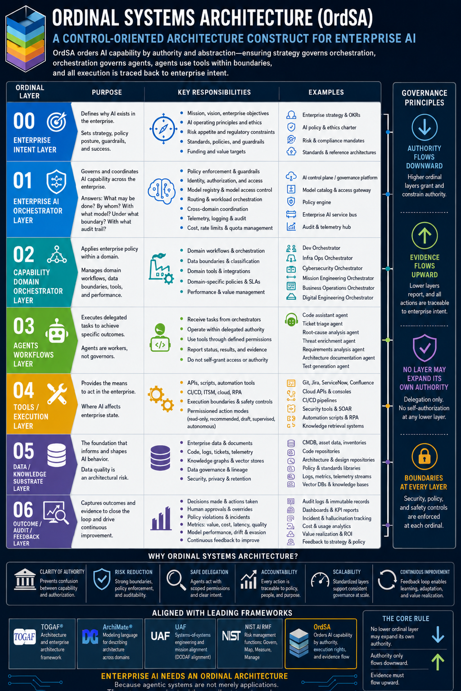

# Ordinal Systems Architecture: A Control Grammar for Enterprise AI Authority

## Abstract

Enterprise AI systems are increasingly deployed as delegated actors within governed enterprises rather than as conventional applications. This shift exposes a gap in the existing enterprise architecture (EA) toolchain: current frameworks describe components, viewpoints, methods, and risk vocabulary, but none specify the authority semantics by which an AI capability is allowed to act. The result is a recurring failure mode in which technical capability is conflated with operational authorization. Ordinal Systems Architecture (OrdSA) introduces a control grammar for that gap. It organises AI capability into seven ordinal layers (Enterprise Intent, an Enterprise AI Orchestrator, Capability Domain Orchestrators, Agents and Workflows, Tools and Execution Channels, a Data and Knowledge Substrate, and an Outcome–Audit–Feedback closure) and governs them with a single architectural principle: authority flows downward, evidence flows upward, and no lower ordinal layer may expand its own authority. OrdSA is canonicalised as a versioned, tool-neutral YAML schema rather than as prose, making conformance mechanically checkable and positioning the construct as complementary to TOGAF, the Unified Architecture Framework, ArchiMate, and the NIST AI Risk Management Framework. This paper presents the construct, its governance principle, the schema-first canonical form, the five-rung execution-rights ladder applied at the tools layer, and the conformance assertions that a conforming deployment must demonstrate.

---



## 1. Introduction

Enterprise AI is treated, in much current architectural practice, as another category of application. Reference architectures place "AI services" alongside business applications and data platforms. Governance is delegated to model selection, prompt review, and post-hoc evaluation. The implicit theory of the AI component is that it is a deterministic function with some uncertainty in its output, a function to be procured, deployed, and monitored like any other.

This treatment fails at a specific point: when an AI capability acts. An AI system that drafts code may push to a repository. An AI system that triages tickets may close them. An AI system that analyses requirements may issue change requests downstream. The activity is not the production of a result, the way a report generator produces a report. It is delegated execution within a governed enterprise. The AI acts in the name of an actor (a team, an orchestrator, a policy regime), within an envelope defined by that actor, and produces effects on enterprise state.

What follows from treating AI as a delegated actor is a separation the application paradigm collapses: the distinction between what the AI can do and what it is authorised to do. A model may, in the technical sense, be capable of issuing a database modification, escalating an incident, or closing a finding. None of those capabilities are claims about authorisation. The decision to confer authority is an architectural and policy decision, not a technical one. Capability and authority are independent dimensions, and the enterprise architecture must carry both.

The frameworks the EA community already uses do not name this separation. TOGAF (The Open Group, 2022) gives a method for developing architecture across business, data, application, and technology layers, but its application layer treats agents as application components. ArchiMate (The Open Group, 2023) provides relationship semantics for components but no native vocabulary for authority delegation between AI components. The Unified Architecture Framework (Object Management Group, 2022) offers a mission-aligned viewpoint stack but no viewpoint specifically scoped to AI capability authority. The NIST AI Risk Management Framework (NIST, 2023) supplies risk-management vocabulary (*govern*, *map*, *measure*, *manage*) but presupposes an architecture to govern, map, measure, and manage. It does not specify what that architecture looks like such that the four functions can be applied with consistent granularity.

Ordinal Systems Architecture addresses that gap. It is not a new EA method, modelling language, viewpoint stack, or risk vocabulary. It is a control grammar: a small, precise vocabulary for the authority relationships between AI components in an enterprise. Its core thesis is the separation OrdSA insists on:

> Enterprise AI cannot be governed only by *components*. It must be governed by *order*.

The remainder of this paper develops that thesis. Section 2 presents the construct: the four ordering dimensions that motivate the term *ordinal*, the seven layers, the governance principle, and the five-rung execution-rights ladder at the tools layer. Section 3 argues for canonicalising the construct as a versioned tool-neutral schema rather than as prose, and describes the construct/deployment two-schema model. Section 4 positions OrdSA against TOGAF, UAF, ArchiMate, and the NIST AI Risk Management Framework, showing how OrdSA composes with each rather than competing. Section 5 describes the canonical visual notation and the schema-driven rendering pipeline. Section 6 catalogues the per-layer anti-patterns the schema surfaces as concrete failure modes practitioners can recognise. Section 7 describes the conformance assertions a conforming deployment must demonstrate. Section 8 closes with the work in motion for the next minor version.

## 2. The Construct

### 2.1 Why "Ordinal"

The construct's name was chosen deliberately. *Ordinal* means ordered, not merely indexed. OrdSA's layers are ordered along four dimensions simultaneously:

1. **Authority**: what each layer is allowed to decide.
2. **Abstraction**: how close to strategy the layer is, versus how close to execution.
3. **Risk**: how much enterprise state the layer can change.
4. **Execution rights**: what kinds of state change the layer can effect (read-only, recommend-only, draft-only, supervised, autonomous).

A higher ordinal *contains* the authority of every lower ordinal. It may delegate any portion of its envelope downward, but a lower ordinal cannot reach upward and acquire rights it was not granted. This is the same structural pattern that governs real enterprises: strategy authorises operations, operations authorise execution, and execution does not authorise itself. The pattern is unusual in current AI architectures, which routinely flatten these levels and treat a capable model as if capability sufficed for authorisation. OrdSA does not flatten them.

### 2.2 The Seven Layers

The seven layers, with the question each governs:

| # | Layer | What it governs |
|---|---|---|
| **O0** | Enterprise Intent | Mission, strategy, policy, risk appetite, standards |
| **O1** | Enterprise AI Orchestrator | Governance, routing, identity, model access, policy enforcement |
| **O2** | Capability Domain Orchestrators | Development, infrastructure, cybersecurity, mission engineering, business operations, digital engineering |
| **O3** | Agents and Workflows | Task-specific AI workers under bounded delegation |
| **O4** | Tools and Execution Channels | APIs, automation, ITSM, CI/CD, cloud, repositories |
| **O5** | Data and Knowledge Substrate | Documents, logs, configuration management database (CMDB), code, policies, telemetry, vector stores |
| **O6** | Outcome, Audit, and Feedback | Evidence, metrics, decisions, incidents, drift, value realisation |

Each layer is briefly characterised below; full per-layer specifications are maintained as companion documents in the construct repository.

**O0, Enterprise Intent.** The strategic surface. Mission outcomes, enterprise objectives, policy posture, risk appetite, regulatory constraints, approved AI operating principles. O0 is mutated only by enterprise governance processes, never by AI activity. Lower layers receive bounded authority traceable back to an O0 element. The OrdSA conformance check that O0 policy is referenced by at least one O1 enforcement element flags policy paragraphs that never operationalise.

**O1, Enterprise AI Orchestrator.** The highest *operational* AI coordination layer. O1 does not perform AI work; it governs it. Its responsibilities are routing, identity, model access, policy enforcement, telemetry, agent registration, and cross-domain coordination. Per invocation, O1 answers: what may be done, by whom, with what model, under what boundary, and with what audit trail. O1 is the single broker for cross-domain coordination. Bypassing it (an agent that authenticates directly to a data system, for instance) is an architectural defect rather than an efficiency choice.

**O2, Capability Domain Orchestrators.** Domain-bounded delegation surfaces. Each O2 instance (a Development Orchestrator, an Infrastructure Operations Orchestrator, a Cybersecurity Orchestrator) inherits policy from O1 and applies domain-specific workflows, data boundaries, tooling, and approval chains. The construct schema disallows omnibus orchestrators that span domains; cross-domain work flows through O1, not through O2-to-O2 lateral coupling.

**O3, Agents and Workflows.** Where agentic systems operate. Agents are *workers, not governors*. They receive bounded tasks from orchestrators, execute within a stated envelope, and do not define their own authority, access, or policy. Agent tool access derives from the envelope, not from intrinsic agent properties. The schema marks any deployment in which an O3 element holds a general right to all tools as nonconforming.

**O4, Tools and Execution Channels.** Where AI begins to affect enterprise state. APIs, scripts, automation tooling, ITSM integrations, CI/CD pipelines, cloud consoles, knowledge retrieval interfaces, engineering repositories. O4 is the point of action enforcement: every tool verifies the envelope before acting, and refused actions emit evidence to O6. Tools that trust the caller without envelope verification are an OrdSA anti-pattern.

**O5, Data and Knowledge Substrate.** Enterprise data, documents, tickets, logs, CMDB, architecture repositories, codebases, policy libraries, threat intelligence, design repositories, and operational telemetry. O5 is not passive infrastructure. In AI systems, data shapes output behaviour, so context poisoning, stale documentation, ambiguous policies, and ungoverned retrieval pipelines are architectural risks rather than mere data-quality issues. Every read is a context insertion attributable to an identity established at O1.

**O6, Outcome, Audit, and Feedback.** The append-only record. Every state-changing action and every policy refusal emits evidence to O6. Aggregated evidence surfaces back to O0 to close the policy loop. AI architecture that lacks O6 telemetry is unverifiable theatre: the system may behave correctly, but the enterprise has no architectural means to confirm it.

### 2.3 The Governance Principle

The architectural core of OrdSA is a single principle stated in three lines:

```
Authority flows downward across layer ordinals.
Evidence flows upward across layer ordinals.
No lower ordinal layer may expand its own authority.
```

Every other rule in OrdSA is a consequence of this principle. The schema's conformance assertions mechanise each line. The execution-rights ladder at O4 ensures that the third line is structurally enforceable rather than merely aspirational. The evidence-flow obligation at O6 closes the loop the first two lines open.

### 2.4 Execution Rights at O4

OrdSA defines five execution rights, ordered by the degree of state change they permit. Each O4 tool declares one of these rights per task class it serves:

| Right | Effect | Human approval per action |
|---|---|---|
| **read_only** | No state change. Inspection, analysis, retrieval only. | No |
| **recommend_only** | No state change. Produces candidate actions for higher-ordinal approval. | No |
| **draft_only** | Creates inert proposals (pull requests, change requests, plans). Does not enact. | No |
| **supervised** | State change. Each action requires per-action approval by a human or higher-ordinal authority. | Yes |
| **autonomous** | State change inside the envelope without per-action approval. | No |

The ladder is not a recommendation. The construct schema requires each O4 tool entry to declare one of these five rights for each task class it serves; deployments that fail to declare are nonconforming. The ladder gives the enterprise a structural means to make distinctions that natural-language policy collapses: "the agent has access to GitHub" can mean any of the five, and the difference matters.

## 3. Schema-First Canonical Form

OrdSA's canonical source is not its prose documentation but a versioned, tool-neutral YAML schema. This is a load-bearing decision worth describing (per ADR-ORDSA-0001 in the construct repository).

The alternative was to canonicalise the construct as ArchiMate, SysML v2, the UAF metamodel, or a custom textual domain-specific language. Each option was rejected on a single ground: each locks adopters into a specific tool ecosystem, which silently violates OrdSA's vendor-neutral posture. The construct claims to be complementary to TOGAF, UAF, ArchiMate, and the NIST AI Risk Management Framework. The choice of canonical format must respect that claim. A YAML schema with a published JSON Schema validation artifact (per ADR-ORDSA-0002) reaches all four communities without endorsing any one of them.

The schema is the artifact adopters cite, pin to a version, and validate against. Prose documentation (including this paper, the construct's `concept.md`, and the per-layer expansions) is a companion artifact. It explains the schema, but it is not the source of truth. When prose and schema disagree, the schema is correct and the prose is updated to match.

OrdSA separates two schemas (per ADR-ORDSA-0003): the *construct schema*, which defines what OrdSA is (layers, authority semantics, execution rights, governance principle, conformance assertions), and the *deployment schema*, which a specific enterprise's deployment populates to declare its layer instances, envelopes, and tool registrations. The construct schema is immutable within a minor version; the deployment schema is the per-organisation artifact. This split keeps the construct stable for citation while allowing organisational adaptations.

Conformance is mechanically checkable. The current schema declares six assertions a conforming deployment must satisfy. The first four are required:

- **layered_authority_only**: every cross-layer relationship is either an authority delegation (downward by exactly one ordinal) or an evidence flow (upward by any amount). Lateral coupling between same-ordinal elements is nonconforming.
- **no_self_elevation**: no element grants itself execution rights beyond its declared envelope. Self-elevation by an O3 agent is not representable in the deployment schema; the conformance check is structural, not policy-dependent.
- **o4_execution_rights_declared**: every O4 tool entry declares one of the five execution rights for each task class it serves.
- **o6_evidence_loop_closed**: every state-changing action at O4 (rights *supervised* or *autonomous*) has a documented evidence path to O6.

Two further assertions are recommended in the current schema revision and may be promoted to required in a future minor version as adopter feedback accumulates:

- **o0_to_o1_policy_translation**: every O0 policy element is referenced by at least one O1 enforcement element; untranslated policies are flagged as gaps.
- **provenance_on_o5_retrieval**: every O5 retrieval interface exposed to AI invocations carries provenance metadata.

The required/recommended distinction is intentional. Required assertions encode the structural invariants OrdSA cannot relax without losing its identity as a construct. Recommended assertions encode practices the construct's authors believe will become required as the standard matures, but where current adopter feedback does not yet justify mechanically blocking conformance.

## 4. Positioning Relative to Existing Frameworks

OrdSA is complementary to TOGAF, UAF, ArchiMate, and the NIST AI Risk Management Framework. It does not replace any of them. It supplies what they currently lack for Enterprise AI: a control grammar for authority across AI capability layers.

### 4.1 TOGAF

TOGAF provides the Architecture Development Method (ADM), a governance discipline, and a vocabulary for stakeholder concerns, requirements management, and architecture views (The Open Group, 2022). TOGAF does not name the distinction between delegated execution actors and applications; in TOGAF terms, an agent is an application component, which collapses the authority question OrdSA exists to surface.

Where OrdSA plugs in:

- TOGAF's Business Architecture is the natural home for OrdSA's O0.
- TOGAF's Application Architecture is where O1, O2, and O3 live, but with the authority layering OrdSA names.
- TOGAF's Technology Architecture is where O4 and O5 live.
- TOGAF's Architecture Governance discipline operates over O6.

A TOGAF practitioner gains, from OrdSA, a way to populate the AI-specific portions of those architectures with a consistent authority model rather than ad-hoc per-project decisions.

### 4.2 UAF — Unified Architecture Framework

UAF (Object Management Group, 2022) supplies mission-driven, systems-of-systems modelling and a multi-viewpoint architecture stack (Strategic, Operational, Services, Resources, Security, Projects, Standards, Actual Resources, Personnel) with strong fit for organisations where mission alignment is central, particularly defence, aerospace, and large-program engineering. UAF's view stack does not have a viewpoint specifically for AI authority layering; AI components appear in Services and Resources views, but the authority chain between them is not part of the standard.

OrdSA composes with UAF as an additional AI-capability-authority viewpoint:

- UAF's Strategic viewpoint maps to O0.
- UAF's Operational viewpoint, in an enterprise-AI context, is where O1 and O2 sit.
- UAF's Services and Resources viewpoints are where O3, O4, and O5 live.
- UAF's Security viewpoint and OrdSA's authority discipline are complementary: UAF provides the security-controls model, OrdSA provides the AI-specific authority-flow model those controls protect.

### 4.3 ArchiMate

ArchiMate (The Open Group, 2023) is a modelling language for describing, analysing, and visualising relationships across business, application, and technology layers of an enterprise, pairing naturally with TOGAF. ArchiMate elements describe relationships and components, but the authority semantics between AI components are not part of the language.

OrdSA contributes a stereotype set: `«ordsa:O1-orchestrator»`, `«ordsa:O3-agent»`, `«ordsa:O4-tool»`, and so on, paired with explicit authority-delegation and evidence-flow relationships. ArchiMate Business Layer elements model O0 policies and objectives; Application Layer elements model O1, O2, and O3 with OrdSA-defined authority relationships drawn between them; Technology Layer elements model O4 and O5; Implementation and Migration elements track OrdSA layer maturity over time.

### 4.4 NIST AI Risk Management Framework

The NIST AI RMF (NIST, 2023) supplies a risk-management vocabulary structured around four functions (*govern*, *map*, *measure*, *manage*) for AI systems, sector-neutral and lifecycle-spanning. The AI RMF is a risk-management overlay; it does not specify what the AI system architecture looks like such that the four functions can be applied with consistent granularity.

OrdSA supplies the structural surface:

- AI RMF *Govern* maps to O0: policy, principles, risk appetite, accountability structures.
- AI RMF *Map* maps to O1: knowing what is happening, by whom, with what model, under what envelope.
- AI RMF *Measure* maps to O6: evidence, metrics, drift, incidents.
- AI RMF *Manage* maps to the closed loop from O6 back to O0: adjusting policy, hardening enforcement, refining envelopes.

The pairing is concrete. AI RMF tells the practitioner what to govern, map, measure, and manage; OrdSA tells the practitioner the structural surface on which those activities take place.

### 4.5 Combined View

| If you have... | Pair it with OrdSA for... |
|---|---|
| TOGAF | An AI-specific authority model populating the Application and Technology architectures |
| UAF | An AI-capability authority viewpoint complementing the existing UAF stack |
| ArchiMate | A stereotype set and authority-relationship vocabulary for AI components |
| NIST AI RMF | The structural target the four functions are exercised over |

OrdSA does not try to be a method, a modelling language, a viewpoint stack, or a risk vocabulary. It is a control grammar, and a control grammar is composable with all of the above.

## 5. Visual Notation and Rendering

OrdSA's canonical visual notation is ArchiMate 3.2 (per ADR-ORDSA-0005). The choice was made on two grounds. First, ArchiMate is the modelling language most likely to be already-fluent in the enterprise-architecture audiences OrdSA most directly serves. Second, ArchiMate has a tool-neutral interchange format (the ArchiMate Open Exchange XML) that allows OrdSA-rendered diagrams to flow into ArchiMate-aware tooling (Archi, Sparx EA, Cameo, Visual Paradigm, including UAF adopters via Cameo's UAF plugin) without endorsing any one tool.

The reference rendering pipeline is schema-driven. The canonical YAML construct or deployment schema is loaded by reference Python tooling, which constructs an ArchiMate object model in memory and emits two artifacts:

1. ArchiMate Open Exchange XML: the cross-tool portability artifact.
2. SVG via pyArchimate's native `View.to_svg()` rendering with auto-layout. PNG and PDF are post-processed from the SVG.

This is not a cosmetic choice. By generating diagrams from the schema at build time rather than authoring them by hand in a GUI, OrdSA preserves the schema-first principle across the visual layer. Edits to the diagram are edits to the schema; the rendering is deterministic. Pull requests do not contain hand-tweaked SVG coordinates. Contributors do not need any GUI tool installed; the editor and the validator suffice.

The reference renderer, pyArchimate (released 2026-05-14), is GPL-3.0-licensed. To avoid imposing GPL on OrdSA's distributed Python tooling (which is Apache-2.0 per ADR-ORDSA-0004), pyArchimate is invoked as a build-time subprocess rather than as an imported library. The boundary is documented and load-bearing; importing pyArchimate as a library would create a licence conflict.

A documented fallback exists if the subprocess posture becomes untenable: Archimate-PlantUML rendered via Kroki HTTP, an MIT-licensed pipeline covering the Business, Application, Technology, Motivation, Strategy, and Implementation layers of ArchiMate. The fallback is documented but not yet implemented; it exists as an escape valve, not a hedge.

## 6. Anti-Patterns the Schema Surfaces

A construct's value depends in part on the failure modes it can name. OrdSA's schema declares an anti-pattern catalogue at each layer: a concrete set of recognisable defects that adopters can map their existing AI deployments against. A selection illustrates the shape.

**At O0:**

- *Aspirational-only policy*: policy that names a stance but does not specify an enforcement surface.
- *Component-level policy*: policy authored at the component level rather than the enterprise level, producing inconsistency between teams.

**At O1:**

- *Smart router with no policy view*: an orchestrator that selects models well but does not enforce identity, scope, or audit obligations.
- *Agents authenticate directly*: agents holding their own credentials to enterprise data systems, bypassing O1 authorisation.
- *Policy in code only*: policy expressed as application code rather than as a declared O1 ruleset, making it invisible to governance review.

**At O3:**

- *General agent, all rights*: a single agent with broad tool access used across task classes, defeating envelope-based delegation.
- *Self-elevating agents*: agents that, on encountering a permission boundary, escalate their own access. Structurally prohibited by the schema.
- *Tool affinities as authorisation*: treating "the agent uses this tool" as a permission grant.

**At O4:**

- *Tools that trust the caller*: execution channels that act on requests without verifying the envelope.
- *Tools without refusal evidence*: execution channels that refuse actions silently rather than emitting evidence to O6.

**At O5:**

- *Single source nobody updates*: substrate referenced as canonical but maintained by no one.
- *Retrieval without provenance*: retrieved context entering AI inference without the identity, source, and timestamp attached.

**At O6:**

- *Evidence in too many places*: multiple parallel evidence stores without a canonical aggregator, making cross-layer queries impossible.
- *Mutable evidence*: evidence stores that allow update or delete, defeating the append-only invariant.
- *The audit log we never read*: telemetry written but not surfaced to O0 for policy adjustment.

The catalogue is intentionally short of exhaustive; it is calibrated to the failure modes practitioners encounter most often. The full per-layer set is maintained in the construct schema and updated as field experience accumulates.

## 7. Conformance

A conforming OrdSA deployment is one whose deployment-schema instance satisfies the required assertions in Section 3 and, where practical, the recommended assertions. Conformance is intended as a continuous discipline rather than a one-time certification. The construct's separation of construct and deployment schemas supports re-validation against future construct versions as the standard evolves.

The v0.2 release of the schema introduces reference validation tooling in Python (per ADR-ORDSA-0004), built on pydantic models that load a deployment schema and report per-assertion pass or fail. The validator is intended as a build-time and continuous-integration check rather than a deployment gate. Conformance is a property the deployment carries with it, not a one-time certificate.

Adopters operating in enterprises with existing assurance regimes (FedRAMP, ISO/IEC 27001, SOC 2, defence assurance practices) can map OrdSA conformance into their existing evidence pipelines: each O4 execution-rights declaration, each O6 evidence-flow entry, and each conformance assertion result becomes an artifact such regimes can ingest. OrdSA does not replace these assurance regimes; it provides an architecture against which their evidence requirements are organised.

## 8. Discussion and Future Work

OrdSA's premise (that enterprise AI requires governance by order, not just by component) drove the v0.1 prose specification, the founding ADR bundle that established schema-first canonicality and reference tooling, and the v0.2 schema sketch presented here. Three lines of work close out the construct's near-term roadmap:

1. **Reference tooling.** A Python validator (pydantic-backed) that loads a deployment schema and reports conformance against the construct schema, plus a JSON Schema emitter that produces the formal validation artifact from the YAML construct.
2. **Visual rendering.** The first ArchiMate-rendered diagrams via the pyArchimate pipeline (per ADR-ORDSA-0005), produced from the schema at build time rather than by hand.
3. **Worked examples.** Concrete deployment-schema instances for representative enterprise scenarios, with the conformance report attached as evidence the construct is operationalisable rather than aspirational.

Open questions that the v0.2 work will surface include: whether the recommended assertions can be promoted to required without locking out reasonable deployments; how to express temporal authority delegation (envelopes that expire or escalate); whether the five-rung execution-rights ladder needs a sixth rung for envelope-bounded autonomy with sampling-based human review; and what level of detail the cross-tool ArchiMate stereotype set should specify.

The construct's posture is open to revision under those questions, but the architectural core (the seven layers, the governance principle, and the schema-first commitment) is stable.

## Acknowledgments

The OrdSA construct repository is maintained autonomously by OlogosAI under the prime-and-review governance arrangement that delegates construct-level decisions to the AI agent and reserves direction-setting and ratification for the authors. The architectural poster that illustrates this paper was produced by OlogosAI in collaboration with the authors during the v0.1.6 milestone.

The authors thank the maintainers of pyArchimate for the timely v1.9.1 release that made the schema-first visual rendering pipeline practical without a Java runtime dependency.

JD Longmire is a Northrop Grumman Fellow. OrdSA is unaffiliated research conducted in a personal capacity; views are the authors' own and do not represent Northrop Grumman Corporation or any other employer.

## References

National Institute of Standards and Technology (2023). *Artificial Intelligence Risk Management Framework (AI RMF 1.0)*. NIST AI 100-1. U.S. Department of Commerce.

Object Management Group (2022). *Unified Architecture Framework (UAF) Domain Metamodel, version 1.2*. OMG document number formal/2022-10-04.

OrdSA Authors (2026a). *Ordinal Systems Architecture — Construct Repository*. Available at: https://github.com/osa-ai-org/ordsa-ai

OrdSA Authors (2026b). *ADR-ORDSA-0001 — Schema-first canonical form*. In: OrdSA Construct Repository, `decisions/ADR-ORDSA-0001-schema-first-canonical-form.md`.

OrdSA Authors (2026c). *ADR-ORDSA-0002 — Schema language: YAML and JSON Schema*. In: OrdSA Construct Repository, `decisions/ADR-ORDSA-0002-schema-language-yaml-json-schema.md`.

OrdSA Authors (2026d). *ADR-ORDSA-0003 — Construct vs deployment schemas*. In: OrdSA Construct Repository, `decisions/ADR-ORDSA-0003-construct-vs-deployment-schemas.md`.

OrdSA Authors (2026e). *ADR-ORDSA-0004 — Reference tooling: Python and pydantic*. In: OrdSA Construct Repository, `decisions/ADR-ORDSA-0004-reference-tooling-python-pydantic.md`.

OrdSA Authors (2026f). *ADR-ORDSA-0005 — ArchiMate as canonical modelling tool*. In: OrdSA Construct Repository, `decisions/ADR-ORDSA-0005-archi-as-canonical-modeling-tool.md`.

OrdSA Authors (2026g). *ADR-ORDSA-0006 — Rename construct abbreviation from OSA to OrdSA*. In: OrdSA Construct Repository, `decisions/ADR-ORDSA-0006-rename-construct-to-ordsa.md`.

The Open Group (2022). *TOGAF Standard, 10th Edition*. The Open Group.

The Open Group (2023). *ArchiMate 3.2 Specification*. The Open Group. Available at: https://pubs.opengroup.org/architecture/archimate3-doc/

U.S. Department of Defense (2021). *Modular Open Systems Approach (MOSA) Implementation Guidebook*. Office of the Under Secretary of Defense for Acquisition and Sustainment.
